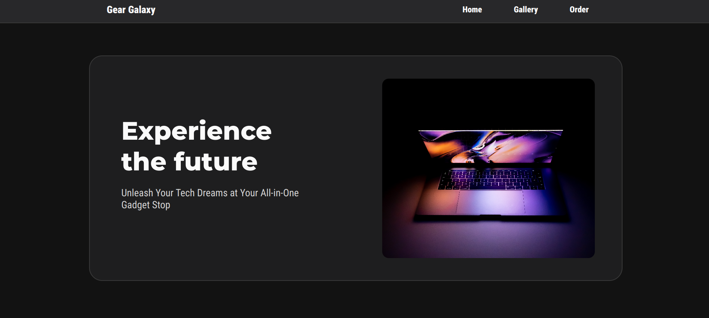

# Landing Page Website - TOP second project

## Hello there! 👋 I am Christian Ortiz, and this is my solution for the landing page project on [The Odin Project.](https://www.theodinproject.com/lessons/foundations-landing-page)

### This is one of my projects while learning front-end web development. My other projects can be seen [here.](https://github.com/progchris00)

## Tools I used for building this project:
- Plain HTML and CSS
- Visual Studio Code
- Git and Github

## Link to the project
- Code: [Github Repository](https://github.com/progchris00/TOP-Projects/tree/main/Project-2-Landing)
- Live Site URL - [Github Page](https://progchris00.github.io/TOP-Projects/Project-2-Landing)

## Project Description
This website is one of the projects I created while taking the foundational section of the [Odin Project.](https://www.theodinproject.com/). 

On this project, I applied all the knowledge I gained while studying the foundational topics. 

The content of the website is just made up and does not portray a real-world brand.

## Project Goal
The goal of the project is to imitate the design using the knowledge the learners have gained so far. [Image One (Full Design)](https://cdn.statically.io/gh/TheOdinProject/curriculum/81a5d553f4073e593d23a6ab00d50eef8620796d/foundations/html_css/project/imgs/01.png), [Image Two (Color and Fonts)](https://cdn.statically.io/gh/TheOdinProject/curriculum/81a5d553f4073e593d23a6ab00d50eef8620796d/foundations/html_css/project/imgs/02.png)

However, it is also stated that the content and design can be substituted, thus requiring me to create and apply my own design while following the given wire frame.

## Inspiration
Some inspiration for the project's design comes from this short [tiktok video](https://www.tiktok.com/@its_baqi/video/7230124876332272902) 

## Credits for the photo
I do not own any photos used in this project. See the links below.
- [turned on laptop on table](https://unsplash.com/photos/turned-on-laptop-on-table-HyTwtsk8XqA) by @danielkorpai
- [macbook pro turned on displaying music
](https://unsplash.com/photos/macbook-pro-turned-on-displaying-music-lzh3hPtJz9c) by Joshua Woroniecki
- [Turned-on Black Samsung Android Smartphone Displaying Clock at 12:09](https://www.pexels.com/photo/turned-on-black-samsung-android-smartphone-displaying-clock-at-12-09-404280/) by Noah Erickson
- [Close-Up View of a Mechanical Keyboard](https://www.pexels.com/photo/close-up-view-of-a-mechanical-keyboard-7915211/) by RDNE Stock Project